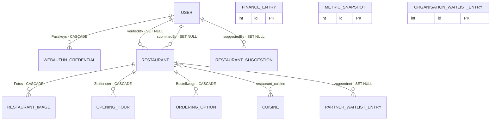

# Datenmodell

Referenz aller Doctrine-Entities, Enums und Repositories von Endlech.lu.

Wer eine Spalte, einen Constraint oder eine Relation sucht, findet sie hier — ohne
zwölf Entity-Dateien zu öffnen. Die Quelle bleibt der Code: bei Abweichungen gilt
`src/Entity/`, nicht dieses Dokument.

Verwandte Dokumente: [Design-System](design-system.md) · [PRD](prd.md) ·
Implementierungs-Fallstricke in [`../CLAUDE.md`](../CLAUDE.md)

---

## Inhalt

1. [Überblick](#überblick)
2. [Konventionen](#konventionen)
3. [Beziehungsdiagramm](#beziehungsdiagramm)
4. [Entity-Referenz](#entity-referenz)
5. [Enum-Referenz](#enum-referenz)
6. [Repository-Referenz](#repository-referenz)
7. [Semantische Besonderheiten](#semantische-besonderheiten)
8. [Migrations-Historie](#migrations-historie)

---

## Überblick

Zwölf eigene Entities, gruppiert nach fachlichem Zweck. Dazu kommen drei Mappings
aus dem WebAuthn-Bundle (`Webauthn\CredentialRecord`,
`Webauthn\PublicKeyCredentialEntity`, `Webauthn\PublicKeyCredentialUserEntity`) —
`php bin/console doctrine:mapping:info` meldet deshalb 15.

| Gruppe | Entities | Zweck |
|---|---|---|
| **Kern** | `Restaurant`, `RestaurantImage`, `OpeningHour`, `OrderingOption`, `Cuisine` | Das Verzeichnis selbst: Häuser, Fotos, Öffnungszeiten, Bestellwege, Küchen |
| **Community & Konto** | `RestaurantSuggestion`, `User`, `WebauthnCredential` | Vorschläge aus der Community, Konten, Passkeys |
| **Vertrieb** | `PartnerWaitlistEntry`, `OrganisationWaitlistEntry` | Zwei Wartelisten mit Double-Opt-In (Restaurants bzw. Gemeinden/Unternehmen/Vereine) |
| **Transparenz** | `FinanceEntry`, `MetricSnapshot` | Was der Betrieb kostet und wie sich die Kennzahlen entwickeln — Grundlage von `/open` |

Elf Enums (alle `string`-backed) liegen in `src/Enum/`, zwölf Repositories in
`src/Repository/`, 26 Migrationen in `migrations/`.

⚠ **Zwei Features haben bewusst keine Entity und tauchen hier deshalb nicht auf:**
Feature `03` (Vergleichsseiten, `App\Comparison\`) und Feature `05` (Presse-Kit,
`App\Press\`). Beide halten ihre Inhalte als unveränderliche Wertobjekte im
Quelltext und ihre Texte in einer eigenen Übersetzungsdomain; sie legen keine
Tabelle an und bringen keine Migration mit. Wer für eines von beiden ein Schema
sucht, sucht vergeblich — das ist kein Rückstand dieser Datei.

---

## Konventionen

- **Naming-Strategy** `underscore_number_aware` (`config/packages/doctrine.yaml`) —
  Tabellen- und Spaltennamen werden aus den PHP-Namen abgeleitet
  (`nearbyStopsNote` → `nearby_stops_note`). Nur zwei Entities setzen einen Namen
  von Hand.
- **Zeitstempel** sind durchgängig `datetime_immutable` bzw. `date_immutable`.
  `createdAt` wird immer im Konstruktor gesetzt und hat nie einen Setter.
- **Zwei Namen mussten ausweichen**, weil sie in MySQL reserviert sind:
  - `User` → Tabelle `` `user` `` mit Backticks (`#[ORM\Table(name: '`user`')]`)
  - `FinanceEntry::$date` → Spalte `entry_date`
- **Geld** liegt als `decimal` mit `scale: 2` vor, nie als `float` — und immer als
  positiver Betrag. Die Richtung steckt im Feld `type`.
- **Enums** werden über `enumType:` gemappt. Eine Ausnahme:
  `OrderingOption::$platform` ist ein blanker String und wird per
  `getPlatformEnum()` aufgelöst.
- **`ON DELETE`** ist bewusst gesetzt: `CASCADE`, wo der Datensatz ohne sein
  Elternteil sinnlos wäre (Fotos, Öffnungszeiten, Passkeys), `SET NULL`, wo er
  eigenständig weiterlebt (wer ein Restaurant eingereicht oder verifiziert hat).
- **Kein Soft-Delete**, keine Audit-Tabellen, keine `deletedAt`-Spalten.

---

## Beziehungsdiagramm



**Die drei beziehungsfreien Entities sind Absicht, kein Versehen:**

- `FinanceEntry` hat kein Feld für Vertragspartner, Restaurant oder Rechnungsnummer.
  Die Beträge werden auf `/open` veröffentlicht — was nicht erfasst ist, kann nicht
  versehentlich mit veröffentlicht werden.
- `MetricSnapshot` ist eine eingefrorene Momentaufnahme. Ein Fremdschlüssel auf
  lebende Daten würde genau das aufheben, wofür es die Entity gibt.
- `OrganisationWaitlistEntry` verweist auf keine Gemeinde-Entity, weil es keine
  gibt: Gemeinden sind ein Freitextfeld plus die Zuordnung in
  `App\Open\CantonResolver`.

`PartnerWaitlistEntry::$restaurant` bleibt `null`, bis das Haus tatsächlich im
Verzeichnis steht — die Anmeldung geht der Aufnahme voraus.

---

## Entity-Referenz

### Restaurant

`src/Entity/Restaurant.php` · Tabelle `restaurant` · `RestaurantRepository`

Die zentrale Entity: ein Gastronomiebetrieb mit allem, was über seine
Barrierefreiheit bekannt ist. 35 Spalten, keine expliziten Indizes außer den
beiden Fremdschlüsseln.

**Grunddaten**

| Property | Spalte | Typ | Null | Default | Anmerkung |
|---|---|---|---|---|---|
| `id` | `id` | `integer` PK | – | AUTO | `IDENTITY` |
| `name` | `name` | `varchar(150)` | nein | `''` | |
| `city` | `city` | `varchar(100)` | nein | `''` | Freitext — die Zuordnung zu Gemeinde und Kanton macht `CantonResolver` |
| `emoji` | `emoji` | `varchar(10)` | nein | `'🍽️'` | Ersatz für ein Titelbild in Listen |
| `rating` | `rating` | `double` | **ja** | `null` | 0–10, **redaktionell gepflegt** — es gibt keine Nutzer-Bewertungen |
| `createdAt` | `created_at` | `datetime` | nein | Konstruktor | kein Setter |

**Barrierefreiheit** — sechs Merkmale, alle `boolean NOT NULL`, PHP-Default `false`

| Property | Spalte | Getter |
|---|---|---|
| `isWheelchairAccessible` | `is_wheelchair_accessible` | `isWheelchairAccessible()` |
| `hasAccessibleToilet` | `has_accessible_toilet` | `hasAccessibleToilet()` |
| `allowsAssistanceDogs` | `allows_assistance_dogs` | `allowsAssistanceDogs()` |
| `hasBrightLighting` | `has_bright_lighting` | `hasBrightLighting()` |
| `hasChangingTable` | `has_changing_table` | `hasChangingTable()` |
| `hasDisabledParking` | `has_disabled_parking` | `hasDisabledParking()` |

**Maße** — die einzigen Felder, die „unbekannt" von „nein" unterscheiden

| Property | Spalte | Typ | Null | Anmerkung |
|---|---|---|---|---|
| `doorWidthCm` | `door_width_cm` | `int` | **ja** | `null` = nicht ausgemessen |
| `tableSpacingCm` | `table_spacing_cm` | `int` | **ja** | `null` = nicht ausgemessen |

**Zahlung, Ernährung, Verifikation** — alle `boolean NOT NULL`, PHP-Default `false`

| Property | Spalte | Getter |
|---|---|---|
| `acceptsCash` / `acceptsCard` / `acceptsPayconiq` | `accepts_cash` / `accepts_card` / `accepts_payconiq` | `acceptsCash()` … |
| `isVegan` / `isVegetarian` / `isHalal` | `is_vegan` / `is_vegetarian` / `is_halal` | `isVegan()` … |
| `isVerified` | `is_verified` | `isVerified()` |

| Property | Spalte | Typ | Null |
|---|---|---|---|
| `verifiedAt` | `verified_at` | `datetime` | ja |

**Sprachen, Kontakt, Standort, Notizen**

| Property | Spalte | Typ | Null | Anmerkung |
|---|---|---|---|---|
| `spokenLanguages` | `spoken_languages` | `json` | nein `[]` | Werte aus `Language`; Getter liefert `Language[]`, unbekannte Werte werden verworfen |
| `phone` | `phone` | `varchar(30)` | ja | |
| `email` | `email` | `varchar(180)` | ja | **nicht** im offenen Datensatz |
| `website` | `website` | `varchar(500)` | ja | |
| `instagramUrl` / `facebookUrl` / `tiktokUrl` | `instagram_url` / `facebook_url` / `tiktok_url` | `varchar(500)` | ja | |
| `latitude` | `latitude` | `decimal(10,8)` | ja | |
| `longitude` | `longitude` | `decimal(11,8)` | ja | |
| `nearbyStopsNote` | `nearby_stops_note` | `longtext` | ja | redaktioneller Zusatz zu den automatisch ermittelten Haltestellen |
| `accessibilityNotes` | `accessibility_notes` | `json` | nein `[]` | Freitextliste |

**Relationen**

| Property | Art | Ziel | Details |
|---|---|---|---|
| `cuisines` | ManyToMany | `Cuisine` | JoinTable `restaurant_cuisine` (PK aus beiden Spalten), `cascade: ['persist']`, unidirektional |
| `verifiedBy` | ManyToOne | `User` | `SET NULL` · Index `IDX_restaurant_verified_by` |
| `submittedBy` | ManyToOne | `User` | `SET NULL` · Index `IDX_EB95123F79F7D87D` |
| `images` | OneToMany | `RestaurantImage` | `cascade: persist+remove`, `orphanRemoval`, `OrderBy sortOrder ASC` |
| `orderingOptions` | OneToMany | `OrderingOption` | `cascade: persist+remove`, `orphanRemoval` |
| `openingHours` | OneToMany | `OpeningHour` | `cascade: persist+remove`, `orphanRemoval`, `OrderBy dayOfWeek ASC, openTime ASC` |

**Konstanten**

```php
public const int MIN_DOOR_WIDTH_CM = 90;     // DIN 18040-1
public const int MIN_TABLE_SPACING_CM = 90;
```

Sie werden von der Entity, dem Repository-Filter und `App\Open\AccessibilityScore`
geteilt — die Schwelle steht genau einmal im Projekt.

**Helper mit Geschäftslogik**

| Methode | Rückgabe | Bedeutung |
|---|---|---|
| `hasWideDoors()` | `?bool` | `doorWidthCm >= 90`; **`null`, wenn kein Maß erfasst ist** |
| `hasWheelchairTableSpacing()` | `?bool` | dito für `tableSpacingCm` |
| `hasCoordinates()` | `bool` | Breite **und** Länge gesetzt |
| `hasContactInfo()` | `bool` | irgendein Kontakt- oder Social-Feld gefüllt |
| `getCuisineNames()` | `string` | Küchen kommagetrennt |
| `getSpokenLanguages()` | `Language[]` | JSON → Enum, unbekannte Werte gefiltert |
| `setSpokenLanguages()` | `static` | akzeptiert `Language[]` **oder** `string[]` |
| `getCoverImage()` | `?RestaurantImage` | erstes Bild nach `sortOrder` |
| `getGalleryImages()` | `Collection` | alle Bilder außer dem Coverbild |
| `getOpeningHoursForDay(int)` | `OpeningHour[]` | alle Zeitfenster eines Wochentags |

> **Die drei Zustände der Maße.** `true` heißt „breit genug", `false` heißt
> „gemessen und zu schmal", `null` heißt „nie ausgemessen". Nur deshalb kann die
> Detailseite „90 cm" von „keine Angabe" unterscheiden. In der iOS-API stehen die
> beiden Werte im eigenen Block `measurements` und nicht in `accessibility`, wo
> jedes Feld ein Boolean ist.

---

### RestaurantImage

`src/Entity/RestaurantImage.php` · Tabelle `restaurant_image` · `RestaurantImageRepository`

| Property | Spalte | Typ | Null | Default |
|---|---|---|---|---|
| `id` | `id` | `integer` PK | – | AUTO |
| `filename` | `filename` | `varchar(255)` | nein | `''` |
| `altText` | `alt_text` | `varchar(255)` | **ja** | `null` |
| `uploadedAt` | `uploaded_at` | `datetime` | nein | Konstruktor |
| `sortOrder` | `sort_order` | `int` | nein | `0` (auch als Spalten-Default) |

**Relation:** `restaurant` ManyToOne → `Restaurant`, `inversedBy: 'images'`,
`nullable: false`, `ON DELETE CASCADE`. Die Property ist auch in PHP nicht
nullable — ein Bild ohne Haus gibt es nicht.

Die Dateien liegen unter `public/uploads/restaurants/`; `ImageUploadService`
löscht sie beim Entfernen mit und sortiert die verbleibenden per
`reorderAfterDelete()` lückenlos nach.

---

### OpeningHour

`src/Entity/OpeningHour.php` · Tabelle `opening_hour` · `OpeningHourRepository`

| Property | Spalte | Typ | Null | Default | Anmerkung |
|---|---|---|---|---|---|
| `id` | `id` | `integer` PK | – | AUTO | |
| `dayOfWeek` | `day_of_week` | `int` | nein | `1` | 1 = Montag … 7 = Sonntag |
| `openTime` | `open_time` | `time` | **ja** | `null` | |
| `closeTime` | `close_time` | `time` | **ja** | `null` | |

**Relation:** `restaurant` ManyToOne → `Restaurant`, `inversedBy: 'openingHours'`,
`nullable: false`, `ON DELETE CASCADE`.

> **Ein Tag kann mehrere Zeitfenster haben.** Der frühere Unique-Constraint auf
> `(restaurant, day)` ist in `Version20260619000000` gefallen, ebenso die Spalte
> `is_closed`. Mittag und Abend sind zwei Datensätze; **ein geschlossener Tag hat
> gar keinen**. Wer auf `is_closed` prüft, sucht ein Feld, das es seit Juni 2026
> nicht mehr gibt.

---

### OrderingOption

`src/Entity/OrderingOption.php` · Tabelle `ordering_option` · `OrderingOptionRepository`

| Property | Spalte | Typ | Null | Default | Anmerkung |
|---|---|---|---|---|---|
| `id` | `id` | `integer` PK | – | AUTO | |
| `platform` | `platform` | `varchar(20)` | nein | `''` | Wert aus `OrderingPlatform`, aber **ohne `enumType`** |
| `url` | `url` | `varchar(500)` | nein | `''` | bei `phone` die Telefonnummer |

**Relation:** `restaurant` ManyToOne → `Restaurant`, `inversedBy: 'orderingOptions'`,
`nullable: false`, `ON DELETE CASCADE`.

Weil die Spalte ein blanker String ist, läuft der Zugriff über zwei Helfer:
`getPlatformEnum(): ?OrderingPlatform` (`tryFrom`, also `null` bei unbekanntem
Wert) und `setPlatform(OrderingPlatform|string)`, der beides annimmt.

---

### Cuisine

`src/Entity/Cuisine.php` · Tabelle `cuisine` · `CuisineRepository`

| Property | Spalte | Typ | Null | Unique |
|---|---|---|---|---|
| `id` | `id` | `integer` PK | – | – |
| `name` | `name` | `varchar(80)` | nein | **ja** |
| `slug` | `slug` | `varchar(100)` | nein | **ja** |

Keine Relationen von hier aus — `Restaurant` hält die Verbindung unidirektional.
`__toString()` gibt den Namen zurück, was Symfonys `EntityType` für die
Auswahllabels braucht. Neue Küchen entstehen im Admin per Autocomplete über
`CuisineRepository::findOrCreateByName()`.

---

### RestaurantSuggestion

`src/Entity/RestaurantSuggestion.php` · Tabelle `restaurant_suggestion` · `RestaurantSuggestionRepository`

Ein Vorschlag aus der Community, bevor daraus ein `Restaurant` wird. Die Felder
spiegeln `Restaurant` — mit einem entscheidenden Unterschied: **zwölf davon sind
dreiwertig.**

**Grunddaten**

| Property | Spalte | Typ | Null | Default | Anmerkung |
|---|---|---|---|---|---|
| `id` | `id` | `integer` PK | – | AUTO | |
| `name` | `name` | `varchar(150)` | nein | `''` | |
| `city` | `city` | `varchar(100)` | nein | `''` | |
| `cuisine` | `cuisine` | `varchar(80)` | nein | `''` | **Freitext**, keine Relation zu `Cuisine` |
| `emoji` | `emoji` | `varchar(10)` | nein | `'🍽️'` | |
| `notes` | `notes` | `longtext` | ja | `null` | Freitext der einreichenden Person |
| `status` | `status` | `varchar(20)` | nein | `'pending'` | String-Konstanten, **kein Enum** |
| `adminNote` | `admin_note` | `longtext` | ja | `null` | interner Vermerk |
| `createdAt` | `created_at` | `datetime` | nein | Konstruktor | |

**Die zwölf dreiwertigen Felder** — alle `varchar(10) NULL`, `enumType: TriState`

| Bereich | Properties |
|---|---|
| Barrierefreiheit | `isWheelchairAccessible`, `hasAccessibleToilet`, `allowsAssistanceDogs`, `hasBrightLighting`, `hasChangingTable`, `hasDisabledParking` |
| Zahlung | `acceptsCash`, `acceptsCard`, `acceptsPayconiq` |
| Ernährung | `isVegan`, `isVegetarian`, `isHalal` |

Die Getter behalten ihre untypischen Namen (`isWheelchairAccessible()`,
`acceptsCash()` …), geben aber `?TriState` zurück — nicht `bool`.

**Kontakt und Sprachen** — wie bei `Restaurant`: `spokenLanguages` (`json`, hier
als rohe Strings), `phone`, `email`, `website`, `instagramUrl`, `facebookUrl`,
`tiktokUrl`.

**Standort** (seit 2026-08-24) — `latitude` (`decimal(10,8)`), `longitude`
(`decimal(11,8)`), `nearbyStopsNote` (`longtext`), alle nullable.

> **Warum ein Vorschlag Koordinaten führt, obwohl der Wizard sie nicht abfragt.**
> Seit der Reparatur von BF-24 legt `POST /api/v1/restaurants` einen Vorschlag an
> statt eines öffentlichen Eintrags. Die API nimmt Koordinaten entgegen und prüft
> sie (±90/±180, AK-15) — ohne diese Spalten gingen sie zwischen Eingang und
> Freigabe verloren. Über den Web-Wizard bleiben sie leer.
> `AdminSuggestionController::approve()` überträgt sie mit.

**Relation:** `suggestedBy` ManyToOne → `User`, `SET NULL`, unidirektional.

**Konstanten:** `STATUS_PENDING`, `STATUS_APPROVED`, `STATUS_REJECTED`.

> **Warum `TriState` und nicht `?bool`.** Eine leere Checkbox bedeutete früher
> zweierlei zugleich: „gibt es nicht" und „weiß ich nicht". Für eine
> Barrierefreiheits-Plattform ist das der wichtigste Unterschied überhaupt. Mit
> `?bool` wäre „Weiß nicht" `null` — ununterscheidbar von „noch nicht
> beantwortet", und genau diese Unterscheidung braucht die Pflichtvalidierung im
> Wizard. Deshalb: Enum mit drei Fällen, Property nullable, `NotNull`-Constraint.

---

### User

`src/Entity/User.php` · Tabelle `` `user` `` · `UserRepository`

Backticks im Tabellennamen, weil `user` in MySQL reserviert ist. Implementiert
`UserInterface` und `PasswordAuthenticatedUserInterface`; Klassen-Attribut
`#[UniqueEntity(fields: ['email'])]`.

| Property | Spalte | Typ | Null | Unique | Anmerkung |
|---|---|---|---|---|---|
| `id` | `id` | `integer` PK | – | – | |
| `name` | `name` | `varchar(100)` | nein | – | PHP-Property ist `?string` |
| `email` | `email` | `varchar(180)` | nein | **ja** | zugleich der `UserIdentifier` |
| `roles` | `roles` | `json` | nein | – | `ROLE_USER` wird im Getter immer ergänzt |
| `password` | `password` | `varchar(255)` | nein | – | Hash; wird strukturell **nie** ausgegeben |
| `isVerified` | `is_verified` | `tinyint(1)` | nein | – | E-Mail bestätigt |
| `verificationToken` | `verification_token` | `varchar(64)` | ja | – | nach Bestätigung genullt |
| `verificationTokenExpiresAt` | `verification_token_expires_at` | `datetime` | ja | – | 24 Stunden |
| `pendingEmail` | `pending_email` | `varchar(180)` | ja | – | gewünschte, noch nicht bestätigte Adresse |
| `pendingEmailToken` | `pending_email_token` | `varchar(64)` | ja | – | eigener Token, nicht der Registrierungstoken |
| `pendingEmailTokenExpiresAt` | `pending_email_token_expires_at` | `datetime` | ja | – | 24 Stunden |
| `avatarFilename` | `avatar_filename` | `varchar(255)` | ja | – | Datei unter `public/uploads/avatars/` |
| `webauthnHandle` | `webauthn_handle` | `varchar(64)` | ja | **ja** | dauerhafte Kennung auf dem Gerät |
| `marketingConsentAt` | `marketing_consent_at` | `datetime` | ja | – | Werbe-Einwilligung; `null` = keine. Geht erst nach der E-Mail-Verifikation nach Brevo (Feature 04, AK-05) |
| `createdAt` | `created_at` | `datetime` | nein | – | |

**Relation:** `passkeys` OneToMany → `WebauthnCredential`, `orphanRemoval: true`,
**kein cascade**, `OrderBy createdAt DESC`.

⚠️ **`pendingEmail` trägt bewusst keine Eindeutigkeit.** Zwei Konten dürfen dieselbe
Adresse gleichzeitig vormerken — wer zuerst bestätigt, bekommt sie. Ein Unique-Index
hier wäre zugleich ein Auskunftskanal: Die Fehlermeldung verriete, dass eine fremde
Adresse in einem anderen Konto vorgemerkt ist. Stattdessen prüft
`EmailVerificationController::confirmEmailChange()` beim Einlösen gegen `email` und
räumt den Vorgang ab, statt in eine Unique-Verletzung zu laufen.

⚠️ **Getrennt vom Registrierungstoken.** Ein unbestätigtes Konto hat bereits einen
`verificationToken` — würden sich beide Vorgänge ein Feld teilen, entwertete der eine
den anderen.

**Helper mit Geschäftslogik**

| Methode | Anmerkung |
|---|---|
| `getUserIdentifier()` | die E-Mail-Adresse |
| `getRoles()` | hängt immer `ROLE_USER` an, `array_unique` |
| `generateVerificationToken()` | `bin2hex(random_bytes(32))` → 64 Zeichen, Ablauf `+24 hours` |
| `isVerificationTokenExpired()` | **`true`, wenn gar kein Ablaufdatum gesetzt ist** — ein fehlender Wert gilt als abgelaufen, nicht als unbegrenzt |
| `getAvatarUrl()` | `/uploads/avatars/…` oder `null` |
| `obtainWebauthnHandle()` | erzeugt beim ersten Aufruf `bin2hex(random_bytes(16))` = **32 Zeichen** |

> **Warum 16 Byte und nicht 32.** `PublicKeyCredentialUserEntity` erzwingt
> `strlen($id) <= 64`. Mit `random_bytes(32)` wären es nach `bin2hex` genau 64
> Zeichen — die Grenze, an der die Bibliothek noch nicht bricht, aber kein Spiel
> mehr bleibt. Der Handle ersetzt die Datenbank-ID, weil er dauerhaft auf dem
> Gerät des Nutzers liegt.

---

### WebauthnCredential

`src/Entity/WebauthnCredential.php` · Tabelle `webauthn_credential` · `WebauthnCredentialRepository`

Ein registrierter Passkey. Die Entity **erbt von `Webauthn\CredentialRecord`**;
das Bundle bringt die Spalten der Oberklasse als mapped-superclass mit und trägt
die nötigen DBAL-Typen (`base64`, `aaguid`, `trust_path`) selbst ein. Für die
geerbten Felder steht deshalb kein einziges ORM-Attribut in der Datei.

**Geerbt vom Bundle**

| Spalte | Typ | Null |
|---|---|---|
| `public_key_credential_id` | `longtext` | nein |
| `type` | `varchar(255)` | nein |
| `transports` | `json` | nein |
| `attestation_type` | `varchar(255)` | nein |
| `trust_path` | `json` | nein |
| `aaguid` | `tinytext` | nein |
| `credential_public_key` | `longtext` | nein |
| `user_handle` | `varchar(255)` | nein |
| `counter` | `int` | nein |
| `other_ui` | `json` | ja |
| `backup_eligible` / `backup_status` / `uv_initialized` | `tinyint` | ja |

**Eigene Felder**

| Property | Spalte | Typ | Null | Anmerkung |
|---|---|---|---|---|
| `id` | `id` | `integer` PK | – | |
| `name` | `name` | `varchar(100)` | nein | Anzeigename, beim Anlegen aus dem User-Agent geraten |
| `createdAt` | `created_at` | `datetime` | nein | |
| `lastUsedAt` | `last_used_at` | `datetime` | ja | |

**Relation:** `user` ManyToOne → `User`, `inversedBy: 'passkeys'`,
`nullable: false`, `ON DELETE CASCADE`.

**Indizes**

| Name | Spalten | Besonderheit |
|---|---|---|
| `IDX_webauthn_credential_id` | `public_key_credential_id` | **Präfix-Index über 100 Zeichen** (`options: ['lengths' => [100]]`) |
| `IDX_webauthn_credential_handle` | `user_handle` | |

> **Warum ein Präfix-Index.** Der DBAL-Typ `base64` deklariert sich als CLOB, die
> Spalte wird also LONGTEXT — und LONGTEXT lässt sich in MySQL nur mit
> Längenangabe indizieren. Ohne den Index liefe bei jeder Anmeldung ein
> Full-Table-Scan.

**Helper**

| Methode | Anmerkung |
|---|---|
| `fromRecord(CredentialRecord, User, string)` | statisch; macht aus dem frisch geprüften `PublicKeyCredentialSource` diese Entity |
| `markUsed()` | setzt `lastUsedAt` |

---

### PartnerWaitlistEntry

`src/Entity/PartnerWaitlistEntry.php` · Tabelle `partner_waitlist_entry` · `PartnerWaitlistEntryRepository`

Anmeldung eines Restaurants für das kostenpflichtige Partnerprogramm. Es wird
**keine Zahlung verarbeitet und kein Konto angelegt** — Preise und Paketumfang
stehen noch nicht fest. Implementiert `App\Waitlist\WaitlistEntryInterface`.

| Property | Spalte | Typ | Null | Unique | Anmerkung |
|---|---|---|---|---|---|
| `id` | `id` | `integer` PK | – | – | |
| `restaurantName` | `restaurant_name` | `varchar(180)` | nein | – | |
| `contactName` | `contact_name` | `varchar(120)` | nein | – | |
| `email` | `email` | `varchar(180)` | nein | – | |
| `phone` | `phone` | `varchar(40)` | ja | – | |
| `locality` | `locality` | `varchar(120)` | nein | – | Ort in Freitext |
| `message` | `message` | `longtext` | ja | – | |
| `status` | `status` | `varchar(20)` | nein | – | `WaitlistStatus`, Default `pending` |
| `confirmationToken` | `confirmation_token` | `varchar(64)` | ja | **ja** | Double-Opt-In |
| `confirmedAt` | `confirmed_at` | `datetime` | ja | – | ⚠ **zweideutig**: gesetzt vom Double-Opt-In **und** vom Verwaltungs-Backfill in `applyStatus()` |
| `selfConfirmedAt` | `self_confirmed_at` | `datetime` | ja | – | ⚠ Zeitpunkt der **Selbst**bestätigung — setzt allein `confirm()`. Wer eine belegte Adresse braucht, fragt hier, nicht bei `confirmedAt` (BF-89) |
| `consentAt` | `consent_at` | `datetime` | nein | – | DSGVO-Nachweis, im Konstruktor gesetzt |
| `marketingConsentAt` | `marketing_consent_at` | `datetime` | ja | – | Zeitpunkt der **Werbe**-Einwilligung; `null` = keine. Getrennt von `consentAt`: jene deckt die Kontaktaufnahme zum Angebot (Feature 04) |
| `locale` | `locale` | `varchar(5)` | nein | – | Sprache der Anmeldung, Default `de` |
| `source` | `source` | `varchar(60)` | ja | – | UTM-Quelle oder Referrer-Host |
| `createdAt` / `updatedAt` | `created_at` / `updated_at` | `datetime` | nein | – | `updatedAt` per `#[ORM\PreUpdate]` |

**Relation:** `restaurant` ManyToOne → `Restaurant`, `SET NULL`, unidirektional —
wird erst gesetzt, wenn das Haus im Verzeichnis steht.

**Index:** `IDX_partner_waitlist_status_created` auf `(status, created_at)`.

---

### OrganisationWaitlistEntry

`src/Entity/OrganisationWaitlistEntry.php` · Tabelle `organisation_waitlist_entry` · `OrganisationWaitlistEntryRepository`

Die zweite Warteliste, für drei kommerziell grundverschiedene Gruppen: Gemeinden
(bezahlter Auftrag), Unternehmen (Sponsoring) und Vereine (Beirat, **kein
Geldfluss in beide Richtungen**). Implementiert ebenfalls
`WaitlistEntryInterface`.

**Gemeinsame Felder**

| Property | Spalte | Typ | Null | Unique | Anmerkung |
|---|---|---|---|---|---|
| `id` | `id` | `integer` PK | – | – | |
| `type` | `type` | `varchar(20)` | nein | – | `OrganisationType` |
| `organisationName` | `organisation_name` | `varchar(180)` | nein | – | |
| `contactName` | `contact_name` | `varchar(120)` | nein | – | |
| `contactRole` | `contact_role` | `varchar(120)` | ja | – | |
| `email` | `email` | `varchar(180)` | nein | – | |
| `phone` | `phone` | `varchar(40)` | ja | – | |
| `website` | `website` | `varchar(255)` | ja | – | |
| `message` | `message` | `longtext` | ja | – | |
| `status` | `status` | `varchar(20)` | nein | – | `WaitlistStatus` |
| `confirmationToken` | `confirmation_token` | `varchar(64)` | ja | **ja** | |
| `confirmedAt` / `consentAt` | `confirmed_at` / `consent_at` | `datetime` | ja / nein | – | ⚠ `confirmedAt` ist zweideutig — siehe `PartnerWaitlistEntry` |
| `selfConfirmedAt` | `self_confirmed_at` | `datetime` | ja | – | Zeitpunkt der **Selbst**bestätigung; setzt allein `confirm()` (BF-89) |
| `marketingConsentAt` | `marketing_consent_at` | `datetime` | ja | – | Werbe-Einwilligung; `null` = keine (Feature 04) |
| `locale` | `locale` | `varchar(5)` | nein | – | |
| `source` | `source` | `varchar(60)` | ja | – | |
| `createdAt` / `updatedAt` | `created_at` / `updated_at` | `datetime` | nein | – | |

**Typspezifische Felder** — alle nullable bzw. leeres Array

| Property | Spalte | Typ | gilt für |
|---|---|---|---|
| `communeName` | `commune_name` | `varchar(120)` | Gemeinde |
| `estimatedVenues` | `estimated_venues` | `int` | Gemeinde (Range 1–5000) |
| `timeframe` | `timeframe` | `varchar(20)` | Gemeinde (`OrganisationTimeframe`) |
| `sponsorshipInterests` | `sponsorship_interests` | `json` | Unternehmen (Werte aus `SponsorshipInterest`) |
| `collaborationInterests` | `collaboration_interests` | `json` | Verein (Werte aus `CollaborationInterest`) |

**Indizes:** `IDX_org_waitlist_type_status` auf `(type, status)`,
`IDX_org_waitlist_status_created` auf `(status, created_at)`.

**Validierung in Gruppen.** Die Constraints erzwingen, dass ein Eintrag nur die
Felder seines Typs trägt: Die jeweils fremden Felder haben `IsNull` bzw.
`Count(max: 0)` in den anderen Gruppen. Ein untergeschobenes Fremdfeld führt
damit zu **422**, nicht zu stillem Ignorieren.

> **Warum die JSON-Spalten `string[]` speichern und nicht Enum-Cases.** Die
> Formulare übergeben reine Strings als `choices`. Mit Enum-Cases fänden Model-
> und Choice-Werte nicht zueinander — nichts wäre vorausgewählt, und es bräuchte
> einen Transformer. Die Gültigkeit sichern stattdessen
> `All(Choice(...::values))`-Constraints.

---

### FinanceEntry

`src/Entity/FinanceEntry.php` · Tabelle `finance_entry` · `FinanceEntryRepository`

Ein Posten der öffentlichen Finanzübersicht auf `/open`.

| Property | Spalte | Typ | Null | Default | Anmerkung |
|---|---|---|---|---|---|
| `id` | `id` | `integer` PK | – | AUTO | |
| `date` | **`entry_date`** | `date` | nein | heute | `date` ist in MySQL reserviert |
| `type` | `type` | `varchar(20)` | nein | `expense` | `FinanceType`; redundant zu `category->type()`, aber indiziert |
| `category` | `category` | `varchar(40)` | nein | `hosting` | `FinanceCategory` |
| `amount` | `amount` | `decimal(10,2)` | nein | `'0.00'` | **immer positiv** |
| `quantity` | `quantity` | `int` | ja | `null` | nur bei Inclusion Boxes |
| `note` | `note` | `longtext` | ja | `null` | |
| `createdAt` / `updatedAt` | `created_at` / `updated_at` | `datetime` | nein | Konstruktor | `updatedAt` per `#[ORM\PreUpdate]` |

**Index:** `IDX_finance_entry_type_date` auf `(type, entry_date)` — trägt die
Aggregation für die Transparenzseite.

**Keine Relationen.** Es gibt kein Feld für Vertragspartner, Restaurant oder
Rechnungsnummer: Was nicht erfasst ist, kann nicht versehentlich veröffentlicht
werden.

> **Es gibt kein `setType()`.** Die Richtung setzt ausschließlich
> `setCategory()`, abgeleitet aus `FinanceCategory::type()` — und räumt dabei
> `quantity` weg, wenn die Kategorie keine Stückzahl führt. Eine Ausgabe unter
> einer Einnahmekategorie wäre in der veröffentlichten Summe nicht mehr als
> Fehler erkennbar.
>
> **`setAmount()` normalisiert auf zwei Nachkommastellen.** Symfonys `MoneyType`
> liefert `"42.5"`, die Datenbank `"42.50"` — ohne Normalisierung hinge die
> Schreibweise davon ab, ob die Entity zwischendurch neu geladen wurde.

---

### MarketingContact

`src/Entity/MarketingContact.php` · Tabelle `marketing_contact` · `MarketingContactRepository`

Das **Auftragsbuch** von Feature 04: eine Zeile je E-Mail-Adresse, die festhält,
was in Brevo stehen soll und ob es schon dort steht. Ein Cron-Befehl
(`app:marketing:sync`) arbeitet es ab.

| Property | Spalte | Typ | Null | Unique | Anmerkung |
|---|---|---|---|---|---|
| `id` | `id` | `integer` PK | – | – | wird zugleich als `ext_id` an Brevo übergeben |
| `email` | `email` | `varchar(180)` | nein | **ja** | der fachliche Schlüssel; `setEmail()` normalisiert auf Kleinschreibung |
| `contactName` | `contact_name` | `varchar(120)` | ja | – | |
| `organisationName` | `organisation_name` | `varchar(180)` | ja | – | |
| `locale` | `locale` | `varchar(5)` | nein | – | Sprache der Kampagne |
| `origin` | `origin` | `varchar(20)` | nein | – | `MarketingOrigin` |
| `funnelStatus` | `funnel_status` | `varchar(20)` | ja | – | `WaitlistStatus`; leer bei Konten |
| `consentAt` | `consent_at` | `datetime` | nein | – | Zeitpunkt der Werbe-Einwilligung |
| `revokedAt` | `revoked_at` | `datetime` | ja | – | gesetzt bei Abmeldung über Brevo — die Zeile wird zur **Sperre** |
| `syncState` | `sync_state` | `varchar(20)` | nein | – | `MarketingSyncState` |
| `syncedAt` | `synced_at` | `datetime` | ja | – | |
| `lastError` | `last_error` | `varchar(255)` | ja | – | ⚠ Klasse und Statuscode, **nie** die Antwort im Wortlaut (AK-31) |
| `attempts` | `attempts` | `smallint` | nein | – | Rückzug nach `MAX_ATTEMPTS` (5) |
| `createdAt` / `updatedAt` | `created_at` / `updated_at` | `datetime` | nein | – | `updatedAt` per `#[ORM\PreUpdate]` |

⚠ **Diese Entity hat bewusst KEINE Beziehungen** — die einzige Abweichung von der
`ON DELETE`-Konvention dieses Projekts. Ein Wartelisten-Widerruf **löscht** den
Eintrag; hinge der Löschauftrag an einem Fremdschlüssel, verschwände er mit seiner
Quelle und die Adresse bliebe für immer in Brevo. Der Auftrag muss die Löschung
seiner Quelle überleben. Die Verbindung läuft über die E-Mail-Adresse.

⚠ **Kein Feld für die Freitextnachricht.** Auf einer Barrierefreiheitsplattform kann
dort eine Gesundheitsangabe stehen und damit eine besondere Kategorie nach Art. 9
DSGVO. Was die Tabelle nicht führt, kann nicht abfließen (AK-29).

**Indizes:** `UNIQ_E78FBDB7E7927C74` auf `email` (setzt „eine Adresse, ein Kontakt"
auf Datenbankebene durch), `IDX_marketing_contact_state_updated` auf
`(sync_state, updated_at)` — die einzige Abfrage des Sync-Laufs.

---

### BoardIdea

`src/Entity/BoardIdea.php` · Tabelle `board_idea` · `BoardIdeaRepository`

Eine Idee zur **Plattform** auf dem Community-Board (Feature 06). Nicht zu
verwechseln mit `RestaurantSuggestion` — die schlägt ein *Lokal* vor.

| Property | Spalte | Typ | Null | Anmerkung |
|---|---|---|---|---|
| `id` | `id` | `integer` PK | – | AUTO |
| `title` | `title` | `varchar(120)` | nein | |
| `description` | `description` | `longtext` | nein | max. 2000 Zeichen per Constraint |
| `slug` | `slug` | `varchar(160)` | nein | **bewusst nicht unique**, siehe unten |
| `status` | `status` | `varchar(20)` | nein | `enumType: BoardIdeaStatus` |
| `submittedBy` | `submitted_by_id` | FK → `` `user` `` | ja | `ON DELETE SET NULL` |
| `locale` | `locale` | `varchar(5)` | nein | Sprache der Einreichung |
| `teamResponse` | `team_response` | `longtext` | ja | öffentliche Antwort; bei Ablehnung die Begründung |
| `duplicateOf` | `duplicate_of_id` | FK → `board_idea` | ja | `ON DELETE SET NULL` |
| `publishedAt` | `published_at` | `datetime` | ja | **`NULL` = wartet, gesetzt = öffentlich** |
| `notifiedAt` | `notified_at` | `datetime` | ja | Sperre gegen einen zweiten Mailversand |
| `createdAt` / `updatedAt` | – | `datetime` | nein | `updatedAt` per `#[ORM\PreUpdate]` |

**Indizes:** `IDX_board_idea_public (published_at, status)`,
`IDX_board_idea_queue (published_at, created_at)`.

> **Warum die Sichtbarkeit an `published_at` hängt und nicht am Status.** Die
> fünf Status beschreiben eine *öffentliche* Idee; „wartet auf Freigabe" ist eine
> andere Achse. Vermischt könnte ein Statuswechsel eine veröffentlichte Idee vom
> Netz nehmen. Getrennt ist die Zusage „kein Beitrag war je ohne Freigabe
> öffentlich" eine einzige Bedingung.

> **Warum der Slug nicht unique ist.** Die Adresse lautet `/{id}-{slug}` —
> eindeutig macht sie die Kennung. Ein Unique-Index erzeugte bei zwei
> gleichnamigen Ideen einen Serverfehler, und gleiche Titel sind auf einem
> Wunschboard der Normalfall. `setSlug()` kürzt auf 160 Zeichen, weil der
> Slugger ausdehnt (aus „ß" wird „ss", aus einem japanischen Zeichen bis zu drei
> Buchstaben).

> **Warum es kein Feld für den Anzeigenamen gibt.** Er wird bei jeder Anzeige aus
> `submittedBy` abgeleitet (`App\Board\AuthorName`). Ein eingefrorener
> Schnappschuss überlebte die Kontolöschung und wäre der Weg zurück zur Person,
> den das Löschkonzept ausschließt.

> **Warum es kein Zählerfeld für Zustimmungen gibt.** Gezählt wird in der
> Abfrage. Ein Zählerfeld liefe auseinander, sobald die Fremdschlüssel-Kaskade
> beim Kontolöschen Stimmen entfernt — das geschieht in der Datenbank, am
> Anwendungscode vorbei.

---

### BoardVote

`src/Entity/BoardVote.php` · Tabelle `board_vote` · `BoardVoteRepository`

| Property | Spalte | Typ | Null | Anmerkung |
|---|---|---|---|---|
| `id` | `id` | `integer` PK | – | AUTO |
| `idea` | `idea_id` | FK → `board_idea` | nein | **`ON DELETE CASCADE`** |
| `user` | `user_id` | FK → `` `user` `` | nein | **`ON DELETE CASCADE`** |
| `createdAt` | `created_at` | `datetime` | nein | |

**Unique:** `UNIQ_board_vote_idea_user (idea_id, user_id)` — eine Stimme je Konto
und Idee, erzwungen in der Datenbank.

> ⚠ **Hier kaskadiert es, entgegen der Konvention oben** („`SET NULL`, wo der
> Datensatz eigenständig weiterlebt"). Eine Stimme lebt *nicht* eigenständig
> weiter: Sie ist die Handlung einer Person und ohne sie bedeutungslos. Genau das
> ist der Unterschied zur Idee, die bleibt.

---

### MetricSnapshot

`src/Entity/MetricSnapshot.php` · Tabelle `metric_snapshot` · `MetricSnapshotRepository`

Eine eingefrorene Monats-Momentaufnahme aller Kennzahlen.

| Property | Spalte | Typ | Null | Anmerkung |
|---|---|---|---|---|
| `id` | `id` | `integer` PK | – | |
| `capturedFor` | `captured_for` | `date` | nein | **unique** (`UNIQ_metric_snapshot_month`) — Idempotenz auf DB-Ebene |
| `restaurantCount` | `restaurant_count` | `int` | nein | |
| `verifiedCount` | `verified_count` | `int` | nein | |
| `communesCovered` | `communes_covered` | `int` | nein | |
| `cantonsCovered` | `cantons_covered` | `int` | nein | |
| `averageAccessibilityScore` | `average_accessibility_score` | `decimal(4,2)` | nein | |
| `stepFreeEntrances` | `step_free_entrances` | `int` | nein | |
| `accessibleRestrooms` | `accessible_restrooms` | `int` | nein | |
| `wideDoors` | `wide_doors` | `int` | nein | |
| `wheelchairTableSpacing` | `wheelchair_table_spacing` | `int` | nein | |
| `inclusionBoxesDelivered` | `inclusion_boxes_delivered` | `int` | nein | |
| `totalExpenses` | `total_expenses` | `decimal(12,2)` | nein | |
| `totalIncome` | `total_income` | `decimal(12,2)` | nein | **auch während der Quartalssperre befüllt** |
| `payload` | `payload` | `json` | nein | vollständige Momentaufnahme |
| `createdAt` | `created_at` | `datetime` | nein | |

**Helper:** `setCapturedFor()` normalisiert auf den Monatsanfang 00:00 — sonst
griffe der Unique-Index nicht. `getMonthKey()` liefert `Y-m` für Achsen und JSON.

> **Warum es diese Entity überhaupt gibt.** Ein aus den heutigen Daten
> zurückgerechneter Verlauf ändert sich rückwirkend, sobald jemand einen Eintrag
> bearbeitet. Als Beleg gegenüber einem Ministerium wäre er damit wertlos.
>
> **Der Snapshot speichert die Einnahmesumme auch dann**, wenn `/open` sie wegen
> der Quartalssperre noch nicht zeigt — sonst stünde für die Anfangsmonate
> dauerhaft eine 0 in der Historie.

---

## Enum-Referenz

Elf Enums, alle `string`-backed, alle in `src/Enum/`. Das wiederkehrende Muster:
`transKey()` liefert den Übersetzungsschlüssel, `label()` den übersetzten Text,
`emoji()` ein Symbol, `badgeClasses()` die Tailwind-Farben für ein Abzeichen.

### TriState

Werte: `yes` · `no` · `unknown`
Methoden: `transKey()`, `label()`, `emoji()`, `isYes()`

Die drei Antworten des Vorschlags-Wizards. Verwendet in zwölf Feldern von
`RestaurantSuggestion`. Beim Genehmigen wird „Weiß nicht" wie „Nein" behandelt
(`$suggestion->isWheelchairAccessible()?->isYes() ?? false`), weil `Restaurant`
bei `bool` bleibt.

### WaitlistStatus

| Case | Wert | Bedeutung |
|---|---|---|
| `PENDING` | `pending` | angemeldet, E-Mail noch nicht bestätigt |
| `CONFIRMED` | `confirmed` | Double-Opt-In erfolgt |
| `CONTACTED` | `contacted` | Team hat sich gemeldet |
| `QUALIFIED` | `qualified` | Vorprüfung bestanden |
| `CONVERTED` | `converted` | Abschluss |
| `DECLINED` | `declined` | abgelehnt oder abgesagt |

Methoden: `transKey()`, `label()`, `emoji()`, `badgeClasses()`

Nur der Übergang `pending → confirmed` wird von der anmeldenden Person
ausgelöst; alles Weitere pflegt das Team im Admin. `qualified` sitzt zwischen
Kontakt und Abschluss, weil bei Gemeinden und Unternehmen regelmäßig eine
Vorprüfung dazwischenliegt.

### MarketingOrigin

| Case | Wert | Bedeutung |
|---|---|---|
| `PARTNER` | `partner` | Partner-Warteliste |
| `COMMUNE` | `commune` | Gemeinde |
| `COMPANY` | `company` | Unternehmen |
| `ASSOCIATION` | `association` | Verein |
| `ACCOUNT` | `account` | Nutzerkonto |

Methoden: `transKey()`, `label()`, `brevoValue()`, `fromOrganisationType()`

⚠ Bezeichnet die **Rolle im Vertrieb**, nicht die Person — ausdrücklich **nicht**,
ob jemand selbst von einer Behinderung betroffen ist (Feature 04, AK-30).

### MarketingSyncState

| Case | Wert | Bedeutung |
|---|---|---|
| `PENDING` | `pending` | eingewilligt, noch nicht übertragen |
| `SYNCED` | `synced` | in Brevo vorhanden |
| `FAILED` | `failed` | letzter Versuch scheiterte |
| `REMOVAL_PENDING` | `removal_pending` | Löschauftrag offen |

Methoden: `transKey()`, `label()`, `badgeClasses()`, `isOpen()`

⚠ `FAILED` gehört zu den offenen Zuständen — ein Fehlversuch ist ein Zwischenstand,
kein Endzustand. Ob eine Zeile endgültig liegen bleibt, entscheidet allein ihr
Versuchszähler (BF-86).

### OrganisationType

| Case | Wert | Slug | Geschäftsverhältnis |
|---|---|---|---|
| `COMMUNE` | `commune` | `gemeinden` | bezahlter Auftrag |
| `COMPANY` | `company` | `unternehmen` | Sponsoring |
| `ASSOCIATION` | `association` | `vereine` | Beirat, kein Geldfluss |

Methoden: `transKey()`, `label()`, `emoji()`, `slug()`, `fromSlug()`,
`badgeClasses()`, `values()`

Der Slug für `ASSOCIATION` heißt bewusst `vereine` — sonst lautete die URL
`/organisationen/organisationen`.

### FinanceType

Werte: `income` · `expense`
Methoden: `transKey()`, `label()`, `emoji()`, `sign()` (`+1`/`-1`), `badgeClasses()`

### FinanceCategory

| Richtung | Cases |
|---|---|
| Ausgabe | `hosting`, `email`, `apple_developer`, `domain`, `inclusion_box_materials`, `other_expense` |
| Einnahme | `membership`, `public_funding`, `sponsorship`, `donation`, `other_income` |

Methoden: `type()`, `transKey()`, `label()`, `emoji()`, `tracksQuantity()`,
`casesFor(FinanceType)`

`type()` ist die **einzige** Quelle der Zuordnung Einnahme/Ausgabe im Projekt.
`tracksQuantity()` gilt nur für `INCLUSION_BOX_MATERIALS` — das ist der einzige
Posten, bei dem eine Stückzahl fachlich etwas bedeutet.

### BoardIdeaStatus

`src/Enum/BoardIdeaStatus.php` — `new` · `reviewing` · `planned` · `done` ·
`declined`. Methoden `transKey()`, `label()`, `emoji()`, `badgeClasses()`.

⚠ **„Wartet auf Freigabe" ist kein Fall dieses Enums** — das ist
`publishedAt IS NULL`.

⚠ **`transKey()` liefert einen flachen Schlüssel** (`board.status_new`). Der
Katalogprüflauf scannt Template-Literale und `src/Form/`; einen in PHP
zusammengesetzten Schlüssel sieht er nicht. Eine Abweichung fällt erst im
Browser auf, als roher Schlüsselname auf der Seite — genau so beim Bau von
Feature 06 einmal passiert.

---

### Canton

Alle zwölf Kantone Luxemburgs: `capellen`, `clervaux`, `diekirch`, `echternach`,
`esch_sur_alzette`, `grevenmacher`, `luxembourg`, `mersch`, `redange`, `remich`,
`vianden`, `wiltz`

Methoden: `label()` (amtlicher französischer Name), `communeCount()`

`communeCount()` liefert die Zahl der Gemeinden je Kanton — Stand nach den
Fusionen vom 1. Januar 2024, in Summe **100**. Sie ist der Nenner der
Abdeckungsquote auf `/open`. **Kein `enumType`**: Das Enum wird nur in der
Auswertung benutzt, nicht in einer Spalte.

### Language

Werte: `lu` · `de` · `fr` · `en` · `pt` · `other`
Methoden: `transKey()`, `label()`, `flag()`, `badgeLabel()`

Die von einem Restaurant gesprochenen Sprachen. **Nicht zu verwechseln mit den
vier Oberflächensprachen** (`lb`, `de`, `fr`, `en`) — `pt` und `other` gibt es
nur hier.

### OrderingPlatform

Werte: `uber_eats`, `deliveroo`, `just_eat`, `wolt`, `wedely`, `goosty`, `phone`,
`website`, `other`
Methoden: `transKey()`, `label()`, `emoji()`, `actionTransKey()`,
`actionLabel()`, `logoPath()`

`actionLabel()` unterscheidet „Anrufen" / „Zur Webseite" / „Bestellen".
`logoPath()` liefert den Pfad zu einem SVG unter `public/images/platforms/` — und
`null` für `phone`, `website`, `other`, die nur ein Emoji bekommen.

### OrganisationTimeframe

Werte: `asap` · `this_year` · `next_budget_year` · `unclear`
Methoden: `transKey()`, `label()`

### SponsorshipInterest

Werte: `inclusion_boxes`, `employee_engagement`, `commune_sponsorship`,
`translation`, `workshops`, `other`
Methoden: `transKey()`, `label()`, `values()`

### CollaborationInterest

Werte: `advisory_board`, `data_access`, `joint_communication`, `referrals`,
`other`
Methoden: `transKey()`, `label()`, `values()`

---

## Repository-Referenz

Alle Repositories erben `ServiceEntityRepository`. Aufgeführt sind nur die
eigenen öffentlichen Methoden.

### RestaurantRepository

| Methode | Rückgabe | Zweck |
|---|---|---|
| `findTopRated(int $limit = 6)` | `Restaurant[]` | beste Bewertungen für die Startseite, mit `openingHours` + `cuisines` eager geladen |
| `findPaginated(string $sort, int $page, int $limit, array $filters)` | `Paginator` | die Hauptlisten-Abfrage — siehe unten |
| `countVerified()` | `int` | Anzahl verifizierter Häuser |
| `countCreatedSince(\DateTimeImmutable)` | `int` | Neuzugänge seit Datum (Admin-Dashboard) |
| `findRecent(int $limit = 5)` | `Restaurant[]` | zuletzt angelegte |
| `findBySubmitter(User)` | `Restaurant[]` | Einreichungen eines Nutzers, neueste zuerst |
| `findMetricRows(?\DateTimeImmutable $createdUntil)` | `list<array>` | Rohdaten als Arrays für die Open-Startup-Auswertung; der Zeitfilter erlaubt nachträglich erzeugte Monats-Snapshots |
| `findAllForExport()` | `Restaurant[]` | vollständiger Datensatz für den CC-BY-Export |

**`findPaginated()` im Detail**

Sortierung über `$sort`: `name` (A–Z), `newest` (`createdAt` DESC), sonst
`rating` DESC als Vorgabe.

Vierzehn kombinierbare Filterschlüssel:

| Schlüssel | Wirkung |
|---|---|
| `verified` | nur verifizierte |
| `wheelchair`, `toilet`, `dogs`, `lighting`, `changing_table`, `disabled_parking` | je ein Barrierefreiheitsmerkmal |
| `vegan`, `vegetarian`, `halal` | Ernährungsoptionen |
| `city` | `LIKE %…%` auf `city` |
| `cuisine` | Liste von `Cuisine`-IDs (JOIN) |
| `lang` | gesprochene Sprachen, **UND**-verknüpft — das Haus muss alle gewählten sprechen |
| `open` | gerade geöffnet |

Zwei Stellen verdienen Aufmerksamkeit:

- **`open`** joint die Öffnungszeiten für **heute und gestern** und vergleicht die
  Uhrzeit in `Europe/Luxembourg`. Der Gestern-Zweig fängt Zeitfenster ab, die über
  Mitternacht laufen. Wegen der mehreren Zeitfenster pro Tag steht auf der
  Abfrage `distinct()`.
- **`lang`** nutzt die eigene DQL-Funktion `JSON_CONTAINS`
  (`App\Doctrine\JsonContainsFunction`, registriert in
  `config/packages/doctrine.yaml`), weil die Sprachen in einer JSON-Spalte liegen.

### UserRepository

Implementiert `PasswordUpgraderInterface`.

| Methode | Zweck |
|---|---|
| `upgradePassword(...)` | Rehash beim Anmelden |
| `findByVerificationToken(string)` | Lookup für die E-Mail-Bestätigung |
| `countRegisteredSince(\DateTimeImmutable)` | Neuregistrierungen (Dashboard) |
| `findRecent(int $limit = 5)` | zuletzt registrierte Nutzer |

### WebauthnCredentialRepository

Implementiert `CredentialRecordRepositoryInterface` und `CanSaveCredentialRecord`.
Bekommt zusätzlich die `RequestStack` injiziert, um den Gerätenamen zu raten.

| Methode | Zweck |
|---|---|
| `findAllForUserEntity(PublicKeyCredentialUserEntity)` | alle Passkeys zu einem WebAuthn-Handle |
| `findOneByCredentialId(string)` | Lookup beim Anmelden |
| `saveCredentialRecord(CredentialRecord)` | anlegen **oder** fortschreiben |
| `findForUser(User)` | Passkeys eines Nutzers, neueste zuerst |

> **Zwei Fallen, die den Login lautlos brechen.**
>
> `findOneByCredentialId()` übergibt die **rohe** Kennung, nicht
> `base64_encode(...)`. Doctrine kodiert gebundene Parameter anhand des
> Feld-Mappings selbst; eine Kodierung von Hand käme doppelt an und fände nie
> etwas.
>
> `saveCredentialRecord()` läuft bei **jeder** Anmeldung, nicht nur beim Anlegen:
> Der Signaturzähler wandert mit und ist der Klon-Schutz. Ein reines `persist()`
> erzeugte Duplikate.

### CuisineRepository

`findAllSorted()` · `search(string $query, int $limit = 20)` (LIKE) ·
`findOrCreateByName(string)` (sluggt, sucht, legt bei Bedarf an — ohne `flush`)

### RestaurantImageRepository

`getNextSortOrder(Restaurant): int` — `MAX(sortOrder) + 1`, beginnt bei 1.

### RestaurantSuggestionRepository

`findByStatus(string)` · `countPending()`

### FinanceEntryRepository

| Methode | Zweck |
|---|---|
| `findForAdmin(?FinanceType)` | Admin-Liste, `date` DESC |
| `sumByCategory(FinanceType, ?\DateTimeImmutable $until)` | Summe, Anzahl und Stückzahl je Kategorie — die einzige Auflösung, in der Finanzdaten die Anwendung verlassen |
| `sumByType(FinanceType, ?\DateTimeImmutable $until)` | Gesamtsumme einer Richtung |
| `sumQuantity(FinanceCategory, ?\DateTimeImmutable $until)` | Stückzahl (Inclusion Boxes) |
| `findEarliestDate(FinanceType)` | frühestes Belegdatum — Grundlage der Quartalssperre |
| `findLastUpdatedAt()` | `MAX(updatedAt)`, erscheint als „Stand vom …" |

### MetricSnapshotRepository

`findForMonth(\DateTimeImmutable)` · `findTrend(int $months = 12)` (chronologisch
**aufsteigend**) · `findLatest()`

### PartnerWaitlistEntryRepository

`findOneByConfirmationToken(string)` · `findPendingOlderThan(\DateTimeInterface)` ·
`findFiltered(?WaitlistStatus, string $direction = 'DESC')` · `countByStatus()` ·
`countPending()`

### OrganisationWaitlistEntryRepository

`findOneByConfirmationToken(string)` ·
`findByType(string $type, ?string $status)` ·
`findFiltered(?OrganisationType, ?WaitlistStatus, string $direction)` ·
`countByStatus()` · `countByType()`

`findByType()` nimmt bewusst rohe Strings aus Query-Parametern entgegen und
verwirft unbekannte Werte über `tryFrom()` — ein leeres Ergebnis statt einer
Exception.

### Ohne eigene Methoden

`OpeningHourRepository`, `OrderingOptionRepository`

---

## Semantische Besonderheiten

Entscheidungen, die man dem Schema allein nicht ansieht.

**`Restaurant` bleibt bei `bool`, `RestaurantSuggestion` nutzt `TriState`.**
Beim Genehmigen wird „Weiß nicht" zu `false`. Das ist ein bewusster
Informationsverlust: Ein Durchziehen der Dreiwertigkeit bis `Restaurant` hätte
die Repository-Filter, den `RestaurantTransformer` (dessen Boolean-Vertrag die
iOS-App bedient), fünf Templates und die Fixtures berührt. Die Maße
(`doorWidthCm`, `tableSpacingCm`) sind der Gegenentwurf — dort trägt `null` die
Bedeutung „unbekannt".

**Der Bestätigungs-Token bleibt nach der Bestätigung stehen.** Anders als
`User::$verificationToken`, der genullt wird. Nur so lässt sich ein zweiter Klick
auf denselben Link („bereits bestätigt") von einem unbekannten Token („Link
ungültig") unterscheiden. `confirm()` rendert drei Zustände und wirft nie eine
Exception.

**`FinanceEntry` erfasst absichtlich weniger, als möglich wäre.** Kein
Vertragspartner, kein Restaurantbezug, keine Rechnungsnummer. Die Beträge gehen
nach `/open` — was nicht in der Tabelle steht, kann dort nicht landen.

**Die Einnahmen stehen während der Quartalssperre gar nicht erst im
Ergebnis-Array.** Lägen sie darin und wären nur im Template verborgen, wären sie
über `/open.json` abrufbar. Der Schutz ist strukturell, nicht kosmetisch — der
`MetricSnapshot` speichert die Summe trotzdem.

**Der offene Datensatz enthält keine E-Mail-Adressen und Telefonnummern.** Ein
Sammelabzug davon wäre eine Adressliste, kein Barrierefreiheits-Datensatz.

**Es gibt kein Soft-Delete.** Gelöschte Restaurants sind weg; ihre Fotos,
Öffnungszeiten und Bestellwege gehen per `ON DELETE CASCADE` mit. Was
eigenständig weiterlebt — wer eingereicht, wer verifiziert hat — wird auf `null`
gesetzt.

---

## Migrations-Historie

35 Migrationen, Namespace `DoctrineMigrations`, Verzeichnis `migrations/`.
Format `VersionYYYYMMDDHHMMSS.php`.

⚠ **Die Tabelle unten ist nicht vollständig: Sechs Migrationen vom 24. und
25. August 2026 fehlen** (`20260824120000`, `20260824160000`, `20260825120000`,
`20260825130000`, `20260825140000`, `20260825150000`) — sie stammen aus Feature `01`
und `02`. Der Rückstand ist hier vermerkt und nicht gefüllt, weil das Nachtragen
fremder Features eine eigene Prüfung braucht: Was in einer Referenz steht, muss
jemand gegen den Code gehalten haben.

| Version | Inhalt |
|---|---|
| `20260113160019` | Initiales Gerüst |
| `20260224000000` | `user`-Tabelle mit E-Mail-Verifikation |
| `20260225000000` | `restaurant`-Tabelle |
| `20260301000000` | `restaurant_suggestion` |
| `20260308000000` | Zahlungsmethoden am Restaurant |
| `20260308100000` | Verifikation (`is_verified`, `verified_at`, `verified_by_id`) |
| `20260308110000` | `restaurant_image` |
| `20260314000000` | `spoken_languages` (JSON) |
| `20260314100000` | Ernährungsoptionen |
| `20260314200000` | `ordering_option` |
| `20260314300000` | Kontaktdaten und Social-Media-Links |
| `20260314400000` | `has_changing_table` |
| `20260314500000` | `sort_order` an `restaurant_image`, Backfill nach `uploaded_at` |
| `20260317000000` | `avatar_filename` am User |
| `20260319000000` | `submitted_by_id` am Restaurant |
| `20260320000000` | `has_disabled_parking` |
| `20260321000000` | `opening_hour`, entfernt `restaurant.is_open` |
| `20260322000000` | Koordinaten und `nearby_stops_note` |
| `20260323000000` | `cuisine` + `restaurant_cuisine`, migriert die alte Freitextspalte |
| `20260324000000` | Zahlung, Ernährung, Sprachen, Kontakt an `restaurant_suggestion` |
| `20260619000000` | mehrere Zeitfenster pro Tag: Unique-Constraint und `is_closed` fallen |
| `20260809000000` | Vorschlagsfelder von `boolean` auf Tri-State |
| `20260820000000` | `partner_waitlist_entry` |
| `20260820100000` | `organisation_waitlist_entry` |
| `20260820200000` | `finance_entry`, `metric_snapshot`, Restaurant-Maße |
| `20260821000000` | `webauthn_credential`, `user.webauthn_handle` |
| `20260829120000` | **Feature 04:** `marketing_contact` (Auftragsbuch) + `marketing_consent_at` an beiden Wartelisten und am User |
| `20260829170000` | **BF-89:** `self_confirmed_at` an beiden Wartelisten — trennt den eingelösten Double-Opt-In vom Verwaltungs-Backfill |
| `20260830120000` | `board_idea`, `board_vote` — Community Feedback Board (Feature 06) |

> **Neue Migrationen müssen gegen MariaDB 10.5 laufen.** Lokal und in der CI
> läuft MySQL 8.0, auf Production MariaDB 10.5 — und `deploy.sh` führt bei jedem
> Lauf `doctrine:migrations:migrate` aus. MySQL-8-eigene Syntax (`CHECK` mit
> JSON-Funktionen, Window-Functions in DDL) fällt erst auf Production auf.
> Aus demselben Grund werden Enums als `VARCHAR` gespeichert, nicht als natives
> `ENUM`.
>
> **`doctrine:schema:validate` meldet die Datenbank als „nicht synchron".** Das
> Mapping selbst ist in Ordnung; der Unterschied besteht aus Index-Umbenennungen
> (Doctrine würde die Namen neu generieren) und kosmetischen Typangleichungen.
> Beides ist Altlast und kein Handlungsbedarf.
>
> **`doctrine:migrations:diff` schlägt in diesem Projekt regelmäßig
> Index-Umbenennungen aus Altlasten vor.** Migrationen deshalb von Hand schreiben
> und den Vorschlag nur als Anhaltspunkt nehmen.
